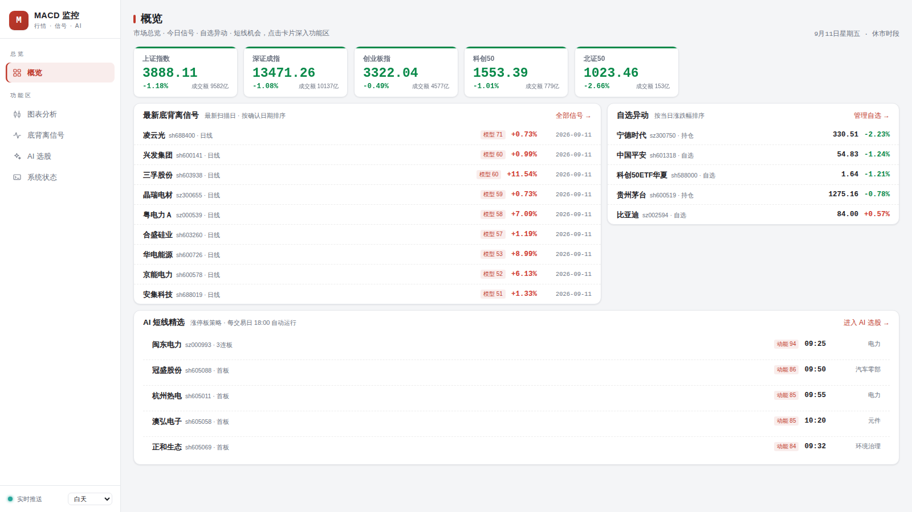
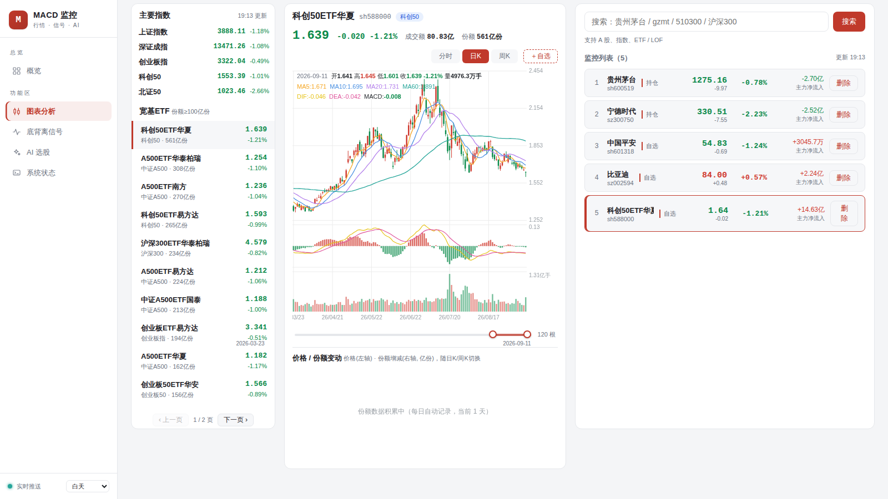
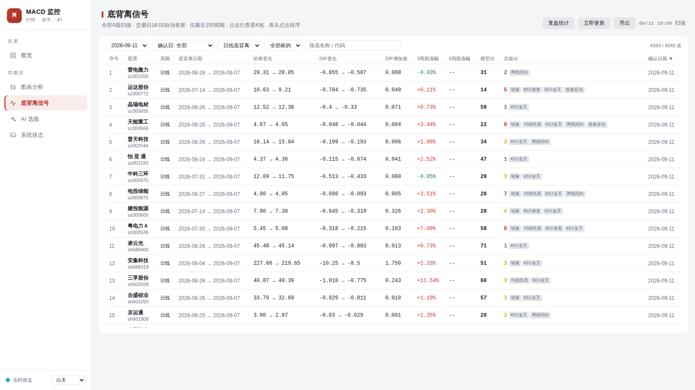
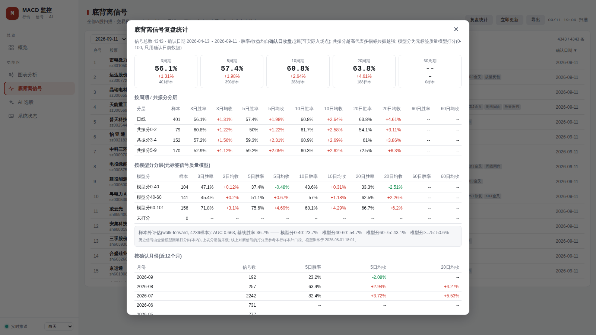
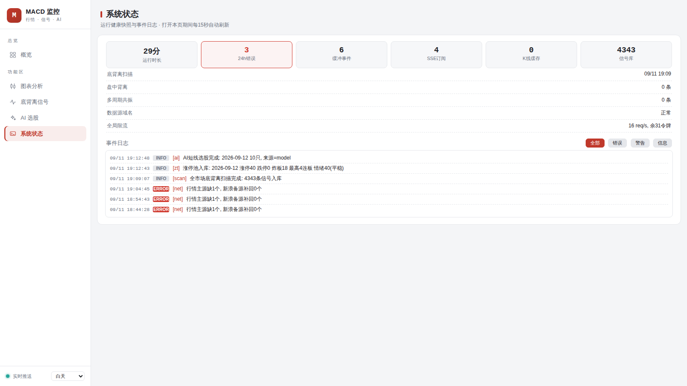
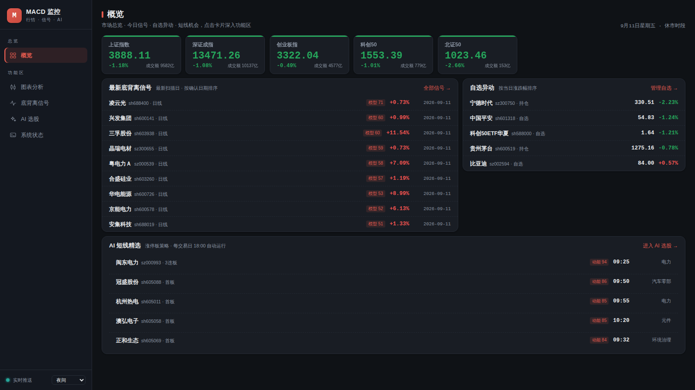
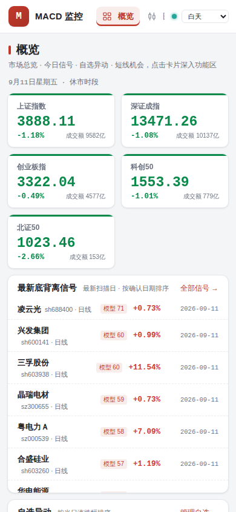

# MACD金叉、死叉、背离自动监控&飞书通知

MACD 金叉/死叉 + 底背离/顶背离监控 + 飞书机器人提醒 + 自选管理 Web UI，数据源为腾讯行情接口，纯 Python 实现，适合部署在 VPS 上长期运行。

## 界面预览

以下截图均为实际部署运行时抓取（行情数据实时拉取自腾讯接口）。

### 整体布局

**左侧固定侧边栏 + 右侧内容区**：侧边栏含品牌区、导航（总览 → 概览；功能区 → 图表分析 / 底背离信号 / AI 选股 / 系统状态）、SSE 实时推送状态灯与主题切换；右侧内容区按功能拆分为五个视图，点击导航切换，最后访问的视图自动记忆，下次打开直达。

### 概览（浅色主题）

一屏掌握市场全局：主要指数卡片（上证 / 深证 / 创业板 / 科创50 / 北证50）、最新底背离信号、自选异动（按当日涨跌幅排序）、AI 短线精选；每张卡片右上"→"一键深入对应功能区。



### 图表分析（三栏工作台）

左栏主要指数 + 宽基ETF列表（固定高度+分页），中栏K线图（**分时 / 日K / 周K** 切换，周期Tab右侧"**＋自选**"一键将当前标的加入监控列表；MA均线 + MACD副图 + 成交量）+ 价格/份额变动面板，右栏自选搜索 + 监控列表。



MA5/10/20/60 均线、MACD 副图（DIF/DEA/柱，与主图窗口联动缩放）、成交量副图；十字光标悬停显示当日价格与指标数值。

### 底背离信号（独立视图）

全市场（约5200只A股）日线/周线底背离扫描结果：模型分、共振评分徽章、DIF增加值、后3/5周期涨幅、确认日期等，独立视图**全宽展示**，**全部列均可点击表头排序**（升降序切换），点击行直接跳转图表分析打开该标的K线。



### 复盘统计

每个信号确认后自动回填 3/5/10/20/60 个交易日收益，按周期、共振分层、确认月份分层展示胜率矩阵，用数据校准共振权重。



### 系统状态（独立视图）

运行时长、24h错误数、SSE订阅数、缓存规模、数据源域名熔断状态等健康卡片 + 实时事件日志（按级别过滤，打开期间15秒自动刷新）。



### 暗色主题与移动端

明暗主题切换（跟随系统/白天/夜间）；移动端侧边栏折叠为顶部横向导航，K线支持单指平移、双指缩放、长按弹出十字光标。

<table>
<tr>
<td></td>
<td></td>
</tr>
</table>

## 目录

* [界面预览](#界面预览)

* [功能](#功能)

  * [MACD 监控（monitor.py）](#macd-监控monitorpy)

  * [自选管理 Web UI（webui.py）](#自选管理-web-uiwebuipy)

* [一键安装](#一键安装)

* [一键卸载](#一键卸载)

* [手动运行（快速开始）](#手动运行快速开始)

* [VPS 服务器部署（systemd 开机自启）](#vps-服务器部署systemd-开机自启)

* [配置说明（config.json）](#配置说明configjson)

* [目录结构](#目录结构)

* [说明](#说明)

## 功能

### MACD 监控（monitor.py）

* 多周期监控：1分钟 / 5分钟 / 30分钟 / 60分钟 / 日线 / 周线

* 金叉 / 死叉信号自动识别，信号去重（同一周期同一根K线只提醒一次）

* 底背离 / 顶背离监控：基于已收盘K线识别 DIF 极值点，价格创新低（新高）而 DIF 低点抬高（高点降低）时提醒；极值确认后触发，同一对极值只提醒一次

* **多周期共振提醒**：同一标的在 ≥2 个周期上同向信号叠加（如 60分钟金叉 + 日线底背离 + 周线金叉）时，以**独立高优卡片**推送飞书（🔥 多周期共振提醒）；每周期取回看窗口内最近一个信号（1m→30根 / 5m→24根 / 30m→8根 / 60m→8根 / 日线→5根 / 周线→3根），同一周期组合只提醒一次，组合升级（双周期→三周期）再次提醒，周期退出后重新聚齐亦再提醒；`config.json` 的 `resonance.enable` / `resonance.min_tfs` 可关闭或调阈值

* 通知策略：交易时段即时推送信号；非交易时段/非交易日信号仅记录不推送

* 飞书机器人推送：支持签名校验、卡片消息、错误日志告警、定时状态汇报

* 仅交易时段扫描（周一至周五 9:25-11:35 / 12:55-15:10），避开未完成K线可选

* 自选股改动实时写入 `config.json`，监控进程自动热加载，无需重启

### 自选管理 Web UI（webui.py）

* **左侧边栏 + 五视图信息架构**：概览（指数卡片 / 最新底背离信号 / 自选异动 / AI 精选一屏总览，点击卡片深入功能区）、图表分析、底背离信号、AI 选股、系统状态；最后访问的视图写入 localStorage 自动记忆，下次打开直达

* **AI 选股视图**：交易日 15:20 自动抓取当日涨停股池（东财数据源，剔除 ST/科创板/北交所）并计算动能分与市场情绪温度，18:00 按动能分 Top30 候选 → DeepSeek 以游资视角精选次日胜率最高的 10 只；候选附现金转化率（经营现金流/利润）财务排雷（≥1 利润含金量高，<0.3 警惕应收堆积，亏损且现金流为负的剔除）；未配置 Key 时降级为动能分 Top10。视图内可配置/测试 API Key、手动扫描涨停池与立即选股，"AI 精选 / 涨停股池"双 Tab 切换，点击行查看K线

* **图表分析 · 左栏 宽基ETF列表**：自动筛选份额 ≥ 100亿份 的宽基ETF（沪深300、中证500、科创50、A500 等），按份额排序，实时刷新；**固定高度 + 分页**（超出自动分页，窗口缩放自适应每页条数，列表不再无限增长）

* **图表分析 · K线本地缓存**：主要指数、宽基ETF及自选股的日K/周K历史数据持久化到 VPS 本地（`kline_cache.json`），仅增量更新最新交易日的收盘数据（每周顺带全量校准一次前复权），非交易日不请求行情接口，加载大幅提速

* **图表分析 · 中栏 K线图**：**分时 / 日K / 周K** 三档切换（分时交易时段8秒自动刷新），周期Tab右侧"**＋自选**"按钮一键将当前标的加入右栏监控列表（默认分组：自选），MA5/10/20/60 均线，**MACD 副图（DIF/DEA/柱，与主图窗口联动缩放，十字光标显示当日值）**，成交量副图，双端日期滑条 + 滚轮缩放，十字光标

* **图表分析 · 中栏 价格/份额变动面板**：K线下方双轴图表

  * 左轴：收盘价折线

  * 右轴：每日/每周份额增减柱（红=净申购、绿=净赎回）

  * 份额数据由系统每日自动快照积累（`etf_share_hist.json`），随日K/周K联动切换

* **底背离信号视图**：侧边栏进入的独立全宽视图，所有字段（股票/周期/底背离日期/价格/DIF/涨幅/共振分/确认日期等）**表头均可点击排序**（升降序切换，空值恒排末尾）

  * **全部A股**（约5200只，不含北交所）日线 / 周线底背离全量扫描，**每个交易日收盘后（北京时间16:00）自动重扫**（约12分钟，含实时进度显示）；周末/节假日不扫描

  * **手动立即更新**：视图右上"立即更新"按钮可随时触发全量重扫，无需等到16:00；手动刷新不影响当日定时扫描（盘中手动扫描基于已收盘K线，与收盘后口径一致）

  * **一键导出CSV**：视图右上"导出"按钮将当前筛选结果导出为CSV（带BOM，Excel打开中文不乱码），文件名含导出时间戳

  * 扫描并发数与请求限速可配：`SCAN_WORKERS`（默认16）、`NET_RATE`（默认16 req/s）环境变量调整；若数据源触发WAF限流可调低

  * 只保留**最近100个周期内**成立的底背离，更早周期自动忽略

  * **SQLite 信号库**（`data.db`）：扫描结果按 (代码+周期+第二低点) 去重后 UPSERT 入库，保留2年供复盘统计；旧 `div_hist.json` 首次启动自动导入并备份为 `.bak`；当日已扫过（含服务重启）直接读库不重扫，大幅降低资源消耗

  * **共振评分**：每个信号基于已拉取的K线本地计算多指标共振标签并加权打分（缩量+2 / 均线托底+2 / RSI修复+1 / KDJ金叉+1 / 周线同向+2 / 放量反包+1，满分9），表格"共振分"列展示分数与标签徽章（可排序），高分信号多指标共振更强

  * **模型分（元标签质量模型）**：对每个信号用 Logistic 回归元标签模型打 0-100 质量分——18 个基础特征 + 15 个交互项（RSI 超卖 / DIF 抬升强度 / 零轴深度 / 缩量 / 均线位置等，全部只用确认日及之前数据，无未来函数），训练标签用三重障碍法（+2ATR 上障碍 / -1ATR 下障碍 / 确认日后 10 根K线垂直障碍，先触上障碍计胜）。模型权重序列化在 `model.json`，线上纯 Python 打分不依赖 sklearn；分数越高代表历史同类信号胜率越高，表头可排序

  * **模型每日自动迭代**：交易日早 6:00 自动重训（`macd-retrain.timer`）——回填最新信号的前向收益 → 重建数据集 → walk-forward 样本外评估（无泄漏时间切分）→ 全量训练更新 `model.json`，持续吸收已走出结果的新信号提升胜率；周末与节假日（内置交易所年度休市表）自动跳过；训练日志写入 `retrain.log`。重训只影响新信号打分，如需刷新库内存量信号的模型分可运行 `python3 backfill_ml.py`

  * **信号跟踪与复盘统计**：每日17:00后台回填每个信号确认日收盘后 3/5/10/20/60 个交易日的收益；底背离信号视图右上"复盘统计"弹窗展示总览胜率/平均收益卡片，及按周期、共振分层、确认月份分层的胜率矩阵——用数据校准共振权重、评估信号质量

  * 表格上方**筛选栏**：按扫描日期（默认最新交易日）/ **确认日期** / 周期（默认日线）/ 是否自选股 / 名称代码关键字组合筛选，实时显示命中条数

  * 展示序号、股票基本信息（名称 / 代码）、底背离日期区间、价格与 DIF 变化、**DIF增加值**、**后3/5周期涨幅**、**模型分**、**共振分**、确认日期

  * 除序号外**全部列表头可点击排序**（升序/降序切换，K线不足显示"--"）

  * 默认按确认日期倒序，确认日期 = 第二个低点被确认为DIF极值的日期（其后4根K线收盘后信号才成立）

  * 点击行自动跳转图表分析视图，在K线图中打开该标的对应周期

  * 股票列表缓存于 `all_stocks.json`（新浪数据源，每日刷新，拉取失败自动回退上次缓存）

* **图表分析 · 右栏 监控列表管理**：搜索添加 A股 / 指数 / ETF / LOF，分组管理，实时行情 + 主力净流入刷新；**固定高度 + 分页，底边线与左栏ETF面板自动对齐**；**点击自选标的可在中栏查看其K线**，自选股的K线同样走本地缓存（增量更新），删除自选时同步清理其缓存

* **SSE 实时推送**（`/api/stream`）：行情由服务端统一聚合拉取（3秒一轮）经 Server-Sent Events 推送到浏览器（含全市场扫描进度、盘中背离预览事件），替代前端各自 5 秒轮询——N 个标签页只有 1 份出网请求；侧边栏底部圆点显示 SSE 连接状态，断线自动重连、失败自动回退轮询

* **盘中实时背离预览**：交易时段每 5 分钟对自选股的 **60分钟K线** 跑一轮底背离检测（基于已收盘60分钟线），自选行实时显示"60分背离"徽章（悬停查看低点价格与 DIF 对比，标记"未收盘确认"），并以**低优先级文本**推送飞书（每信号每日一次）；收盘后仍由 16:00 全市场扫描正式确认

* **多周期共振徽章**：同一轮盘中扫描顺带检测自选股 **60分钟 / 日线 / 周线** 三周期共振（与 monitor.py 同一套算法；日/周走本地K线缓存不额外出网，60m 复用盘中已拉取数据），自选行实时显示"↑N周期共振 / ↓N周期共振"徽章（红=看涨、绿=看跌，悬停查看各周期信号类型与新鲜度），新共振出现时 toast 提醒；交易时段随盘中扫描每 5 分钟刷新，非交易时段每 2 小时低频校准（`/api/resonance`）；飞书共振高优推送由监控进程覆盖全部已配置周期

* **数据源容灾**（`net.py`）：全局限流（令牌桶 8 req/s）+ 域名熔断（连续失败 10 次冷却 5 分钟，防持续打挂的域名）+ 行情双源容灾（腾讯批量主源，缺失代码自动切新浪逐个补齐）；`/api/health` 输出限流/熔断/扫描/SSE 订阅等健康快照

* **可观测性**（`obs.py`）：进程内结构化事件总线（环形缓冲最近 600 条：域名熔断/回切、扫描中断、认证失败等关键事件自动埋点），`/api/logs` 按级别查询、`/api/health` 附带运行时长 / 24h错误数 / 事件数；侧边栏"**系统状态**"视图可视化展示健康卡片（运行时长、错误、SSE 订阅、缓存规模、数据源域名状态）+ 实时事件日志（按级别过滤，打开期间 15 秒自动刷新）

* **PWA**：manifest + Service Worker（`static/sw.js`）——静态外壳预缓存、页面导航网络优先断网回退离线快照、`/api/*` 纯网络不缓存；可安装到手机/桌面主屏幕（含 iOS 主屏引导横幅），断网时顶部显示离线横幅

* **移动端触摸手势**（`chart.js`）：K线图支持单指拖动平移、双指捏合缩放、长按 0.35s 弹出十字光标（跟随手指移动，松手保留供读数）；份额面板支持点按查看数值

* **工程化**：前端图表拆分为 `static/chart.js`（KChart/ShareChart，经典脚本全局作用域安全共享），与业务逻辑 `app.js` 解耦

* 明暗主题切换（跟随系统 / 白天 / 夜间），响应式布局

## 一键安装

复制对应系统的一行命令到终端运行，从克隆代码到验证完成全自动，无需手动 clone：

### Windows（PowerShell，推荐）

```powershell
powershell -ExecutionPolicy Bypass -c "irm https://raw.githubusercontent.com/huigezhi/stock_tracking/main/install.ps1 | iex"
```

命令直接从网络执行，不在本地留下安装脚本。也可以 [下载 install.ps1](install.ps1) 后执行，或使用 [install.bat](install.bat)（双击运行）。

### Windows（cmd）

```bat
curl -fsSL -o %TEMP%\install.bat https://raw.githubusercontent.com/huigezhi/stock_tracking/main/install.bat && %TEMP%\install.bat
```

### Ubuntu / Debian

```bash
bash <(curl -fsSL https://raw.githubusercontent.com/huigezhi/stock_tracking/main/install.sh)
```

### 前置要求

* Windows：[git](https://git-scm.com/download/win) + [Python 3](https://www.python.org/downloads/)（安装时勾选 *Add python.exe to PATH*）

* Ubuntu：无（脚本会用 apt 自动安装缺失的 git / python3 / requests）

### 脚本自动完成的步骤

1. 克隆代码（Windows 到 `%USERPROFILE%\macd-monitor`，Linux 到 `~/macd-monitor`；已存在则 `git pull` 更新，config.json 保留不覆盖）
2. 安装 python 依赖 requests
3. 生成 config.json
4. 运行 `--report` 验证安装

安装完成后：

```bash
python3 monitor.py     # 启动监控 (代码目录下)
python3 webui.py       # 启动 Web UI, 浏览器打开 http://localhost:8688
```

## 一键卸载

删除安装（自动终止运行中的监控进程、移除 systemd 服务、删除安装目录及全部数据，系统依赖如 Python / git 保留）：

### Windows（PowerShell）

```powershell
powershell -ExecutionPolicy Bypass -c "irm https://raw.githubusercontent.com/huigezhi/stock_tracking/main/uninstall.ps1 | iex"
```

### Ubuntu / Debian（本地安装版）

```bash
bash <(curl -fsSL https://raw.githubusercontent.com/huigezhi/stock_tracking/main/uninstall.sh)
```

### VPS 服务器版（含 systemd 服务）

```bash
sudo bash uninstall.sh    # 自动探测 /opt/macd-monitor; 也可指定目录: sudo bash uninstall.sh /opt/macd-monitor
```

注意：卸载会删除 `config.json`（飞书 webhook 配置）、监控状态与底背离扫描缓存等全部数据，如需保留请先备份。

## 手动运行（快速开始）

```bash
# 依赖: python3 + requests
pip3 install requests

# 1. 准备配置
cd macd-monitor
cp config.example.json config.json
# 编辑 config.json, 填入飞书机器人 webhook_url (可选)

# 2. 查看各周期 MACD 状态(不发通知)
python3 monitor.py --report

# 3. 测试一轮扫描+推送
python3 monitor.py --once

# 4. 启动持续监控
python3 monitor.py

# 5. 启动 Web UI (另一个终端)
python3 webui.py
# 浏览器打开 http://localhost:8688

# 重跑今日底背离全量扫描(清除当日缓存, 保留其余29天历史)
python3 webui.py --rescan

# 信号质量模型(模型分)训练与刷新(需额外依赖: pip3 install scikit-learn numpy)
python3 train_model.py       # 回填收益→构建数据集→walk-forward样本外评估→训练保存 model.json
python3 backfill_ml.py       # (可选)训练/重训后为库内存量信号刷新模型分
python3 retrain_daily.py     # (可选)手动触发一次"每日重训"(非交易日自动跳过, 同早6点定时任务)
```

## VPS 服务器部署（systemd 开机自启）

```bash
sudo bash deploy.sh
```

部署脚本会自动：安装依赖 → 克隆代码到 `/opt/macd-monitor` → 生成配置 → 注册 systemd 服务（`macd-monitor` / `macd-webui`）→ 安装模型每日重训定时器（`macd-retrain.timer`，交易日早 6:00 自动重训信号质量模型，自动补装 `scikit-learn`/`numpy`）→ 自检。脚本可重复执行（幂等），更新代码后重跑即可。

Web UI 默认仅监听本机，通过 SSH 隧道访问：

```bash
ssh -L 8688:127.0.0.1:8688 root@你的VPS
# 然后本机打开 http://localhost:8688
```

常用运维命令：

```bash
systemctl status macd-monitor macd-webui   # 服务状态
journalctl -u macd-monitor -f              # 实时监控日志
systemctl restart macd-monitor              # 重启监控
systemctl list-timers macd-retrain         # 模型重训下次触发时间（交易日06:00）
tail -f /opt/macd-monitor/macd-monitor/retrain.log   # 模型重训日志
```

模型重训说明：

* 首次训练需累计 ≥300 条已回填收益的信号样本（新装机器等数据积累，期间 `model.json` 不存在、模型分列为"--"，不影响其他功能）
* 非交易日（周末 + 内置交易所年度休市表，当前为 2026 年）自动跳过；跨年时按交易所次年休市通知更新 `macd-monitor/retrain_daily.py` 中的 `HOLIDAYS_YYYY` 表即可
* 存量部署若只想补装重训定时器（不重跑整个部署），可单独执行：`sudo bash /opt/macd-monitor/macd-monitor/install_retrain.sh`

## 配置说明（config.json）

| 字段                           | 说明                                                                                  |
| ---------------------------- | ----------------------------------------------------------------------------------- |
| `webhook_url`                | 飞书机器人 Webhook 地址，留空则不推送                                                             |
| `webhook_secret`             | 飞书机器人签名密钥，可选                                                                        |
| `webui.auth_token`           | Web UI 访问令牌：留空不启用认证；非空时所有 API 需携带（首次访问弹登录框输入，浏览器记住），同 IP 连续 5 次错误锁定 60 秒。公网部署强烈建议配置 |
| `poll_interval_sec`          | 扫描间隔（秒），默认 30                                                                       |
| `signal_on_forming_bar`      | 是否对未完成K线发信号（默认只确认已完成K线）                                                             |
| `feishu_log_level`           | 推送到飞书的日志级别，默认 WARNING                                                               |
| `feishu_status_interval_min` | 定时状态汇报间隔（分钟）                                                                        |
| `timeframes`                 | 监控周期列表，可删减                                                                          |
| `stocks`                     | 自选股列表（code / name / group），Web UI 中增删自动同步                                           |

## 目录结构

```
├── install.sh            # Ubuntu/Debian 一键安装（本地运行）
├── install.ps1           # Windows 一键安装（PowerShell，支持一行命令）
├── install.bat           # Windows 一键安装（cmd / 双击运行）
├── uninstall.sh          # Linux 一键卸载（终止进程/移除服务/删除目录）
├── uninstall.ps1         # Windows 一键卸载（PowerShell）
├── deploy.sh             # VPS 服务器部署（systemd 开机自启 + 模型每日重训）
├── docs/
│   └── screenshots/       # README 界面截图（实际部署抓取）
└── macd-monitor/
    ├── monitor.py            # MACD 监控 + 飞书推送
    ├── webui.py              # 自选管理 Web UI 后端
    ├── db.py                 # SQLite 存储层（信号库 + 跟踪收益）
    ├── net.py                # 行情网络层（限流/熔断/双源容灾）
    ├── obs.py                # 可观测性（事件总线/健康快照）
    ├── zt.py                 # 涨停池数据层（东财涨停/炸板/跌停 + 情绪温度）
    ├── model.py              # 信号质量模型（元标签特征/三重障碍标签/纯Python打分）
    ├── train_model.py        # 模型训练（回填收益→数据集→walk-forward→保存 model.json）
    ├── backfill_ml.py        # 模型重训后为库内存量信号刷新模型分
    ├── retrain_daily.py      # 交易日早6点自动重训（周末/节假日跳过）
    ├── install_retrain.sh    # 存量部署单独补装重训 systemd timer
    ├── config.example.json   # 配置示例
    └── static/               # 前端静态文件
        ├── index.html / app.js / chart.js / style.css
        └── sw.js             # PWA Service Worker

# 以下均为运行时自动生成（已 gitignore，更新代码不会删除）：
#   config.json            运行配置（自选股、webhook）
#   data.db                信号库 + 收益跟踪（保留2年）
#   model.json             模型权重（每日重训自动更新）
#   dataset.json           训练数据集缓存
#   state.json             信号去重状态
#   etf_share_hist.json    ETF 份额日度快照（自动积累）
#   kline_cache.json       指数/宽基ETF 日K周K本地缓存（增量更新）
#   monitor.log / retrain.log   运行日志 / 重训日志
```

## 说明

* 份额数据无免费公开历史接口，采用每日快照积累方式：系统运行期间每个交易日自动记录一次当前份额，保留最近 500 天，历史曲线随运行时间逐步完整

* 行情数据来自腾讯公开接口（`qt.gtimg.cn` / `ifzq.gtimg.cn`），主力净流入来自新浪接口，仅供个人参考，不构成投资建议

